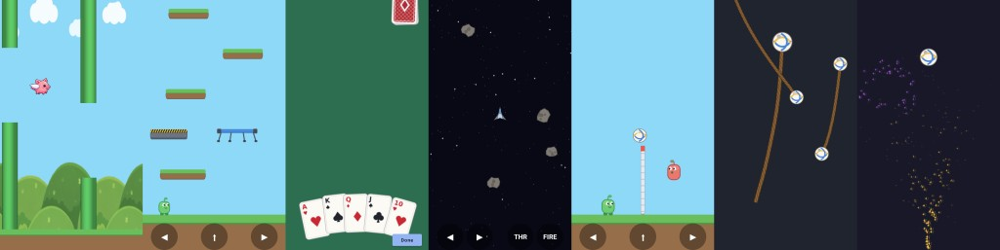

# ti.game

<p align="center">
  
</p>

A 2D sprite game engine module for Titanium SDK (Android and iOS),
rendered with OpenGL ES 2.0. You describe your scene and react to events
from JavaScript; everything that runs every frame — rendering, animation,
physics, collision, gestures — runs natively at 60 fps. The JS API is
identical on both platforms.

**Features**

- Sprite sheets (grid or TexturePacker atlas), frame animations, tweens
- Touch: tap, press, drag & drop, pinch-to-scale, two-finger rotate
- Physics: velocity + gravity, platformer solids, bouncing (restitution),
  arcade car model with drifting + skid marks, Newtonian flight (thrust)
- Collision groups with events, invisible trigger zones, hitbox tuning,
  swept AABB for fast bullets (`swept: true` — no tunneling)
- Parallax scroll looping, screen wrapping, idle wobble animation
- Pixel-art mode (nearest-neighbor filtering), debug overlay for hitboxes
- Sound: low-latency overlapping effects + looping music (`createSound`),
  auto-paused and resumed with the app
- Particles: native pooled emitters (`createEmitter`) — continuous rate or
  bursts, follow a sprite, tint/scale/fade over lifetime
- Verlet ropes (`createRope`) — pin ends to sprites or points, swings
  natively (chains, capes, bridges, grappling hooks)
- Fullscreen camera effects (`cameraEffect`) — tint and glitch shader
  passes over the whole rendered scene; sprite glow highlights
  (`glowColor`/`glowBlur`), per-sprite color tinting (`tintColor`),
  damage flashes (`flash()`) and blend modes (`blend:
  'add'`/`'multiply'`/`'screen'`)
- Bitmap-font text sprites (`createText`) — HUD scores and labels inside
  the GL scene with a built-in pixel font, BMFont/AngelCode or monospace
  grid fonts (`createFont`); `screenFixed` pins any sprite to the surface
  for camera-proof HUDs
- Sprite attachment (`attachTo`) — pin any sprite to another with an
  offset, tracked natively every frame (name tags, health bars, turrets)
- 26 example demos in `example/` covering every feature

New to the module? `tutorial.md` walks through your first scene
step by step — sprite, animation, tap-to-move.

## Quick start

1. Build the module (or grab `android/dist/ti.game-android-<version>.zip`)
   and add it to your app's `tiapp.xml`:

   ```xml
   <modules>
     <module platform="android">ti.game</module>
   </modules>
   ```

2. A minimal game:

   ```javascript
   var Game = require('ti.game');

   var win = Ti.UI.createWindow({ backgroundColor: '#000' });
   var gameView = Game.createGameView({ backgroundColor: '#202030' });

   var sheet = Game.createSpriteSheet({
       image: 'hero.png',
       frameWidth: 64, frameHeight: 64   // grid sheet
       // or: atlas: 'hero.json'         // TexturePacker JSON (hash or array)
       // add smoothing: false for crisp pixel art
   });

   var hero = Game.createSprite({
       sheet: sheet,
       x: 100, y: 200,
       draggable: true,
       animations: {
           walk: { frames: [0, 1, 2, 3], fps: 12, loop: true },
           jump: { frames: [4, 5, 6], fps: 10, frame: 0 }
       }
   });
   hero.play('walk');
   hero.addEventListener('tap', function () { hero.play('jump'); });

   gameView.add(hero);
   win.add(gameView);
   win.open();
   ```

That's the whole model: create a **GameView** (the canvas), create
**SpriteSheets** (textures cut into frames), create **Sprites** (things on
screen), set properties, listen for events. You never write a game loop —
the engine runs it natively.

## Core concepts

### JS describes, native executes

The Kroll bridge (JS ↔ Java) is far too slow for per-frame work. So the
JS API is a *scene description*: setting `sprite.x`, `sprite.velocityY` or
`sprite.throttle` writes into a native object that the render thread reads
every frame. Events flow the other way — the engine fires discrete,
high-level events (`tap`, `dragend`, `collision`, `land`, `complete`),
never anything per-frame. If you find yourself wanting a `setInterval`
that moves a sprite, look for the native feature that does it instead
(velocity, tween, thrust, carMode, ...). Coarse timers for *decisions*
(an AI choosing where to go, autofire) are fine — see the volley and
asteroids demos.

### Coordinates

Top-left origin, y-down, in surface **pixels** — touch coordinates map
1:1. `(x, y)` positions the sprite's anchor point (default `0.5/0.5` =
center). Rotation is in degrees, positive = clockwise.

### Size your level on `resize`, not on the display size

`Ti.Platform.displayCaps` includes the system bars, so bottom-anchored
sprites computed from it can land below the visible surface. The GameView
fires `resize` with the real surface size — build your level there:

```javascript
gameView.addEventListener('resize', function (e) {
    if (!initialized) {
        initialized = true;
        buildLevel(e.width, e.height);   // the actual scene coordinate space
    }
});
```

## Performance: what runs where

Three threads touch a running game — knowing what happens on each is the
key to understanding both the performance and the API design:

| Thread | Runs | Bridge involved? |
|---|---|---|
| **GL render thread** | The entire game loop: delta time, physics (velocity/gravity, solids, `carMode`, `thrust`), collision checks, tween/animation/idle ticking, skid trail, wrapping, z-sorting, batching, drawing | No |
| **Android UI thread** | Touch handling: hit-testing, drag movement, pinch/rotate gestures | No |
| **JS/Kroll thread** | Your game code: creating sprites, setting properties, handling events | Yes — this is the only place the Titanium bridge exists |

**Per frame, on-device, zero bridge traffic.** Every 16 ms tick reads and
writes only native `Sprite` objects in the scene graph. A drag moves the
sprite on the UI thread; a tween, a falling bird, a drifting car, a
bouncing ball all advance on the GL thread. Nothing in the frame loop
waits for — or even talks to — JavaScript, so JS garbage collection or a
busy app thread can't cause stutter.

**What crosses the bridge, and when:**

- *Property writes* (`hero.x = 100`, `car.throttle = 1`) — one cheap
  bridge hop per assignment, writing a volatile field the render thread
  picks up next frame. Setting a property once per user input is the
  intended pattern.
- *Property reads* (`ball.x`) — synchronous snapshot of the live native
  value. Fine for event handlers and coarse timers (the volley AI reads a
  few per 80 ms tick); don't poll them in a tight loop.
- *Events* — fired natively only when something discrete happens, and only
  if a listener is registered (`hasListeners` is checked before paying the
  bridge cost). Continuous gestures are throttled (`drag` at ~10 Hz);
  nothing fires per frame by design.

When building a level, collect its sprites, emitters and ropes and call
`gameView.add(objects)` once. The array crosses the bridge once and is committed
to the native scene under one lock. `gameView.add(object)` remains available for
individual objects.

**Rendering.** Sprites are drawn by an ES 2.0 batcher that accumulates
quads and issues one draw call per texture switch (up to 1000 quads per
batch). Practical consequence: pack your art into as few sheets as
possible — a scene whose sprites share one atlas renders in a single draw
call regardless of sprite count. Per-sprite transform math is done on the
CPU and is trivial at typical scene sizes; hundreds of animated, moving
sprites are no problem. Textures upload to the GPU once, lazily, on first
use; the EGL context is preserved across app pauses, and after a real
context loss everything (textures, shaders) is re-created automatically.

**Batching pitfalls.** Everything that changes GPU state mid-scene cuts
the batch and costs one draw call — invisible on screen, so know the four
sources instead of discovering them in a profiler:

- *Texture switches* — sprites drawn back-to-back from different sheets.
  One shared atlas = one batch.
- *Blend mode changes* — every transition between blend modes
  (`'normal'`/`'add'`/`'multiply'`/`'screen'`) in draw order flushes.
  Alternating blend modes sprite-by-sprite degrades toward one draw call
  per sprite; group same-blend sprites into their own `zIndex` band so
  each frame switches a handful of times, not constantly.
- *Glow and flash* — each glowing sprite switches to the silhouette
  shader and back: **2 extra draw calls per glowing sprite per frame**
  (plus 2 more while a `flash()` runs), even on a shared texture. A few
  highlights are free; putting a glow on every coin in a level is not.
- *Ropes, skid marks and debug overlays* always draw with normal
  blending, so interleaving them with non-normal blend content flushes
  too.

**Collision cost** is O(colliders × candidates) per frame — each sprite
with `collidesWith`/`solidWith` is tested against sprites carrying a
matching `collisionGroup`. Keep group lists targeted (a bullet checking
`['asteroid']` tests 5 sprites, not the whole scene) and it stays
negligible.

**Rule of thumb:** if JS runs code every frame, you're fighting the
engine; if JS only reacts to events and sets properties, you get native
performance for free.

**LiveView.** A LiveView reload replaces Titanium's JavaScript runtime. The
module automatically retires every `GameView` render loop owned by the old
runtime before the reloaded app creates a new one. Repeated reloads therefore
keep a single native game loop instead of accumulating GL/render threads. Your
app should still clear its own JavaScript timers and close unrelated resources
when appropriate; no special cleanup is required for the `GameView` renderer.

**iOS Simulator.** The simulator renders at a 1x logical drawable, because its
translated OpenGL path is disproportionately expensive at a 3x Retina backing
size. Real iPhone and iPad builds keep the device's native screen scale. Even
so, expect the simulator to render the game noticeably slower due to its
OpenGL translation layer — on a real phone the game runs a lot smoother, so
judge performance on device, not in the simulator.

## Building blocks

### Show and animate things

- **Sheets**: `createSpriteSheet({ image, frameWidth, frameHeight })` for
  grids, or `{ image, atlas }` for TexturePacker JSON. `smoothing: false`
  switches to nearest-neighbor filtering for pixel art. Textures load
  lazily on the GL thread and survive EGL context loss automatically.
- **Pixel snapping**: `pixelSnap: true` rounds only the sprite's rendered
  anchor to the nearest framebuffer pixel after camera position and zoom are
  applied. Native physics, collisions and live `x`/`y` remain subpixel floats.
  It defaults to `false`; combine it with `smoothing: false` when a moving
  pixel-art sprite must keep a stable texel phase.
- **Frame animations**: declare named animations on the sprite
  (`{ frames, fps, loop, frame }`), control with `play(name)` / `stop()` / the
  `frame` property. Non-looping animations fire `animationcomplete`; an
  optional `frame` in the definition is the sheet frame shown once the
  animation finishes (default: hold the last animation frame).
  `play('attack', { then: 'idle' })` chains natively — each queued name
  (a string or an array) plays as the previous non-looping animation
  finishes, no `animationcomplete` juggling in JS.
- **Path following**: `sprite.followPath(points, { speed, loop, rotate,
  smoothing })` walks the sprite along the points (`{ x, y }` objects or
  `[x, y]` pairs) natively at `speed` px/s — enemy patrol routes and
  bullet arcs with zero per-frame bridge traffic. `loop` runs a closed
  circuit, `rotate` turns the sprite to face along the path, `smoothing`
  rounds corners with that radius in px (precomputed once, not per
  frame). A non-looping run fires `pathcomplete` at the end;
  `followPath(null)` stops in place. Path movement counts into the
  frame delta, so a path-driven platform still carries its riders.
- **Tweens**: `sprite.animate({ x, y, scale, rotation, opacity, glowOpacity,
  duration, delay, easing, frame })` (ms; easing from the `EASE_*` constants)
  animates natively and fires `complete`; an optional `frame` is the sheet
  frame set once the tween finishes. Chain moves by re-calling `animate` from
  the `complete` handler.
- **Idle wobble**: `idleAnimation: true` adds a gentle organic sway —
  up to `idleRotation` degrees and `idleMovement` px around the base
  transform, `idleSpeed` scales the frequency. Every sprite gets its own
  phase; it composes with tweens/drags and unwinds exactly when disabled.
  Tip: disable it *before* tweening a sprite to a spot where alignment
  matters (see the cards demo).

### React to touch

Enable behaviors per sprite: `draggable` (native drag & drop),
`pinchable` (two-finger scale), `rotatable` (two-finger rotate). The
engine hit-tests taps against the sprites' transformed shapes (rotation
and scale included, topmost first) and fires `press`, `tap`, `dragstart`,
`drag` (~10 Hz), `dragend`, `release`, `pinch`, `rotate`. The drag itself
happens natively — JS only hears the milestones.

Sprite touches are multi-touch: every finger runs its own gesture, so
several sprites can be pressed, tapped or dragged at the same time (each
sprite belongs to at most one finger). A second finger that lands on
empty space — or on the sprite already held — instead pinches/rotates
the held sprite (per its `pinchable`/`rotatable` flags).

The GameView also fires `press` / `tap` / `release` for *every* touch
(tap-anywhere controls, flappy-style). Standard Titanium touch events are
not available on the game view — but ordinary Titanium buttons/views
overlaid on top work normally, and separate views receive simultaneous
pointers, which is how the demos do multitouch d-pads (hold ▶ + jump).

### Move things (pick the model that fits your game)

| Model | Properties | Feels like |
|---|---|---|
| Plain velocity | `velocityX/Y` (px/s), `gravity` (px/s²) | Flappy, projectiles, falling |
| Platformer | velocity + `solidWith`, `onGround`, `land` event | Mario-style run & jump |
| Bouncing body | `restitution` (0..1) on top of `solidWith` | Balls, pinball-ish |
| Car (`carMode`) | `throttle`, `steering` (-1..1); `enginePower`, `maxSpeed`, `turnRate`, `grip`, `drag` | Top-down racer with drift |
| Newtonian flight | `thrust` (px/s² along heading), `angularVelocity` (deg/s), `maxSpeed` | Asteroids |

Notes:

- **Solids**: `solidWith: ['group']` blocks movement against sprites in
  those groups — the engine pushes the sprite out along the axis of least
  penetration. Landing sets read-only `onGround` (gate jumps on it) and
  fires `land`; sides act as walls; below stops upward motion.
- **One-way platforms**: `oneWay: true` on a solid makes it pass-through
  except for landings on its top edge — riders jump up through it and
  are never blocked sideways or from below (classic platformer floors).
- **Moving platforms carry**: solids are ordinary sprites, so move them
  with `velocityX/Y` or a tween — whoever stands on one inherits its
  per-frame movement natively: carried sideways, glued on the way down,
  no re-landing jitter (the platformer demo's patrolling platform).
  `carryRiders: false` on the solid opts out — for world-scroll terrain
  that moves while the player is meant to stay put (the skate demo's
  raised road scrolls left under a skater with a fixed x).
- **Raycasts**: `gameView.raycast(x0, y0, x1, y1, groups)` answers
  "what's the first thing on this line?" without any collision setup on
  the asking side — the targets just need a `collisionGroup`. See the
  GameView method table for the result shape.
- **Pathfinding**: `gameView.findPath(from, to, options)` answers "how
  do I walk there around the obstacles?" — grid A* over the sprites
  carrying a `collisionGroup`, returning waypoints ready for
  `followPath` (pointclick routes around the oak with it; the maze demo
  visualizes the raw and simplified routes and runs a re-pathing
  chaser). A discrete query like `raycast`; see the GameView method
  table for the options.
- **Drift is emergent** in `carMode`: lateral grip is finite, so hard
  cornering at speed keeps sideways momentum. Lower `grip` = more drift.
  `skidMarks: true` leaves fading rubber trails while drifting
  (`skidThreshold` tunes what counts, read-only `drifting` reports it —
  handy for sound effects).
- **Camera**: sprites live in world coordinates; `cameraX`/`cameraY` on
  the GameView scroll the view, `cameraScale` zooms around the view
  center, and `cameraBounds` clamps the visible rect into a level rect.
  `follow(sprite, options)` tracks a sprite natively with dead-zones —
  vertical always (the platformer demo scrolls up when the player climbs
  into the top third), horizontal when `leftMargin`/`rightMargin` are
  given, optionally eased with `smoothing`. `shake()` adds impact rumble
  without touching the camera position. Touch input is mapped back to
  world space automatically (zoom included), so taps and drags work
  while scrolled; overlaid Titanium controls are screen-fixed and
  unaffected.
- **Parallax**: `scrollFactor` on any sprite scales how much camera
  travel moves it — `0.5` makes a background layer scroll at half
  speed, `0` pins it to the view (still zooming, unlike `screenFixed`).
  One property instead of hand-scrolled layers; depth comes free with a
  moving camera.
- **Game-clock timers**: `gameView.after(ms, cb)` / `every(ms, cb)`
  run on the same clock as the engine — delays stretch under
  `timeScale` slow motion and freeze at `0`, and they pause with the
  render loop, unlike `setTimeout`. Spawn waves, AI decision ticks and
  respawn delays belong here so a paused game doesn't keep spawning.
- **Camera effects**: `cameraEffect` (`'none'`/`'tint'`/`'glitch'`)
  applies a fullscreen shader pass to the whole rendered scene —
  `'tint'` multiplies with `cameraTint` (night vision, flashback,
  poison), `'glitch'` is a broken-signal filter (sliced row offsets,
  RGB split, flicker). `cameraEffectIntensity` (0..1) scales either.
  With `'none'` the extra pass is skipped entirely.
- **Screen wrapping**: `wrapAround: true` re-enters from the opposite edge
  (Asteroids). For scrolling backgrounds use `wrapX`/`wrapShift`: two
  screen-wide copies with `{ wrapX: -W/2, wrapShift: 2*W }` and a negative
  `velocityX` make a seamless parallax layer with no JS in the loop.

### Detect hits and score

Tag obstacles with a `collisionGroup` and set
`collidesWith: ['group', ...]` on the moving sprite: it fires a
`collision` event (payload: `group`, `other` sprite, `x`, `y`) once per
overlap-enter and a matching `collisionend` once the shapes separate
(the enter/exit trigger lifecycle — pressure plates, healing zones,
"player left the area"). Removing or hiding the partner mid-contact also
counts as separation. There is deliberately no per-frame "stay" event;
track the in-between state in JS (you heard enter, you'll hear the end)
or poll on a coarse timer. This is independent of `solidWith` — use
solids to *block*, collision events to *react*.

- A sprite with `width`/`height` but **no sheet** renders nothing and
  works as an invisible trigger: score zones, goals, checkpoints,
  ceilings (flappy, racing and volley demos all use these).
- `hitboxScale` shrinks the collision box around the anchor — art rarely
  fills its frame, and slightly small hitboxes feel fairer.
- `hitboxScaleX` / `hitboxScaleY` correct that per axis, multiplied on
  top of `hitboxScale` (both default to 1). When a drawing fills its
  frame by a different fraction on each axis there is no single number
  to pick. `adventurer.png` is a 20x44 drawing in a 32x48 frame: `0.62`
  matches his width but ends 7 px above his feet, `0.92` reaches the feet
  but is 47% wider than he is. He needs `0.62` on X and `0.92` on Y.
  Because they multiply, `hitboxScale` stays the overall adjustment and
  these two are corrections on top of it.
- `hitboxShape: 'circle'` makes the hitbox a circle (radius = half the
  smaller drawn side × `hitboxScale`; the per-axis scales are ignored,
  since a circle has no axes) — for balls and asteroids. Circle
  sprites also resolve against solids along the contact normal, so a
  ball bounces off a corner diagonally instead of like a box (the volley
  ball and the asteroids use it), and their touch area is round.
- **Fast movers tunnel** without help: a bullet that travels further per
  frame than a target is thick never overlaps it on any frame, so the
  discrete test misses. `swept: true` on the moving sprite tests its
  movement as a path (swept AABB) — `collision` events fire for anything
  the path crossed, and `solidWith` walls stop it at the impact point
  instead of letting it teleport through. Circle hitboxes sweep as their
  bounding box; the swept demo shows the comparison side by side.
- `debug: true` on a sprite (or on the GameView for everything) renders
  the shapes: **green** = collision AABB (with `hitboxScale`), **blue** =
  sprite/touch bounds, **orange dot** = anchor.

### Play sounds

```javascript
var jump = Game.createSound({ url: 'assets/jump.wav', volume: 0.8 });
jump.play();   // fire-and-forget; rapid plays overlap

var music = Game.createSound({ url: 'assets/theme.mp3', music: true, loop: true });
music.play();
```

Effect mode (the default) is built for low latency: on Android the sample
lives in a shared `SoundPool`, on iOS in a small pool of preloaded
players — call `play()` from any event handler (`land`, `collision`,
`complete`, a button) and repeated plays overlap instead of cutting each
other off. `music: true` picks the streaming backend
(`MediaPlayer`/`AVAudioPlayer`) for longer tracks; music pauses when the
app goes to the background and resumes with it, like the render loop.
`volume` (0..1) and `loop` are live properties. WAV, MP3 and OGG (Android)
/ WAV, MP3, M4A (iOS) from app resources or file paths.

The skate demo wires `jump.wav`/`crash.wav` into its jump and wipeout
handlers and loops a chiptune track on the music backend; the events
listed under collisions (`land`, `collision`, `drifting`, tween
`complete`) are natural hook points for more.

### Particles

```javascript
var smoke = Game.createEmitter({
    sheet: puffSheet, frame: 0,
    rate: 30,                          // particles/sec while `emitting`
    lifetime: 600,                     // ms, like all JS durations
    speed: 120, angle: 0, spread: 60,  // cone: 0 = up, clockwise degrees
    gravity: -40, size: 24,
    startScale: 1, endScale: 2.5,
    startOpacity: 0.8, endOpacity: 0,
    tint: '#889', zIndex: 9,
    target: car                        // follow a sprite — or set x/y
});
gameView.add(smoke);

boom.emit(30);                         // one-shot burst (rate can stay 0)
```

Spawning, integration, fading and drawing all run in the native game
loop — JS only writes configuration and calls `emit()`. Each particle's
speed is randomized between 50% and 100% of `speed` so bursts don't form
perfect rings; scale and opacity interpolate start → end over `lifetime`.
Particles are pooled (`maxParticles`, default 200, hard cap 1000) and all
share one sheet frame, so an emitter renders as a single batch run —
tint your art at runtime by using white particle textures. Emitters sort
into the scene by `zIndex` (drawing above sprites of the same z). The
skate demo uses both modes: a dust trail following the board
(`target` + `emitting`) and a spark burst on crash (`emit(26)`).

### Ropes

```javascript
var rope = Game.createRope({
    sheet: ropeSheet,          // one frame, textured along each link
    segments: 14,
    segmentLength: 40,         // px
    thickness: 12,             // drawn width, px
    gravity: 1500, damping: 0.98, iterations: 3,
    head: ball,                // pin the head to a sprite — or set x/y
    zIndex: 5
});
gameView.add(rope);
```

A native Verlet chain: integration and distance constraints run in the
game loop, segments render as quads oriented along the rope (one sheet
frame → one batch run). Pin the `head` to a sprite — a draggable ball, a
character's hand — and the rope follows with zero bridge traffic, or use
`x`/`y` for a fixed anchor. An optional `tail` sprite pins the other end
(hanging weights, bridges). `endX`/`endY` read the live position of the
loose end (grappling-hook tips). See `rope.js` for both variants.

With a `tail` sprite, `maxLength` (px, 0 = off) turns the rope into a
tether: whenever the head→tail distance exceeds it, the rope pulls the
sprites back onto the limit each frame and cancels their outward
velocity — so a falling weight snaps taut and swings like a pendulum
instead of stretching the rope (leashes, wrecking balls, yo-yos). The
tether yields at the end no finger owns: with a fixed head anchor the
tail sprite is simply leashed, but with sprites on both ends you can
drag either one and the other is towed behind once the rope goes taut
(carts, chained crates).

### Draw text

```javascript
var score = Game.createText({
    text: 'SCORE 0',
    x: 16, y: 40, anchorX: 0, anchorY: 0,
    scale: 3,                  // bitmap fonts size by scale
    screenFixed: true,         // stick to the surface, ignore the camera
    zIndex: 100
});
gameView.add(score);
score.text = 'SCORE 10';       // native re-layout next frame
```

Text objects ARE sprites: they z-sort (`zIndex`/`ySort`), tween
(`animate`), wobble (`idleAnimation`), tint, `flash()`, glow, fire touch
events (text buttons need no overlay views) and scroll with the camera —
all glyphs render as quads in the same batch, so a label costs one draw
call. With no `font`, a built-in monospace pixel font is used (combine
with integer `scale` values for crisp pixels). Custom fonts:

```javascript
// BMFont/AngelCode (.fnt text or JSON export, kerning included) — made
// by BMFont, Hiero, fontbm or tools/genfont.py
var font = Game.createFont({ font: 'assets/hud.fnt' });

// or a monospace grid image: cells row-major for ASCII 32..126
// (or pass `characters` for a custom set)
var font = Game.createFont({ image: 'assets/mono.png', charWidth: 9, charHeight: 15 });

var label = Game.createText({ font: font, text: 'HELLO' });
```

Multi-line text uses `\n` with `align: 'left'|'center'|'right'`;
`letterSpacing` (px) and `lineSpacing` (multiplier) tune the layout.
`maxWidth` (px) word-wraps automatically — dialog boxes need no
hand-broken `\n` lines, and updating `text` re-wraps (a word wider
than `maxWidth` overflows rather than breaking mid-word).
`tools/genfont.py` rasterizes any TTF into either format. The built-in
font covers ASCII 32..126 — stick to plain characters or ship a font
with more glyphs.

`screenFixed: true` works on any sprite, not just text: the sprite's
`x`/`y` become surface coordinates and camera position, zoom and shake
are ignored — HUDs, on-screen buttons, overlays. Touch events map back
automatically (see `text.js`: the score HUD stays put while the camera
follows the ball).

To put a label ON a sprite — a name tag, a health readout — attach it:

```javascript
var tag = Game.createText({ text: 'PLAYER 1', zIndex: 6 });
tag.attachTo(hero, { offsetY: -40 }); // 40 px above the hero's anchor
gameView.add(tag);
```

The tag follows the hero natively every frame (physics, tweens, drags,
moving platforms included) with no per-frame JS. `attachTo` works on any
sprite, not just text — see the Sprite methods reference.

### Depth in top-down scenes

`ySort: true` sorts sprites within the same `zIndex` by their **bottom
edge** (feet, trunk base) instead of a fixed order — walk below a tree
and you draw in front of it, walk above and you vanish behind the canopy.
Give the player, trees and buildings the same `zIndex` with `ySort`, keep
ground tiles on a lower `zIndex`, and the Zelda-style depth illusion
falls out automatically (see `topdown.js`).

## Learn from the examples

`example/app.js` is a launcher; each demo is a self-contained file showing
a feature set — find the one closest to your game and start there:

| Demo | Shows |
|---|---|
| `basic.js` | Sheets, animations, drag/pinch/rotate, tween chaining |
| `puzzle.js` | Drag & drop with snapping, press-to-lift, tween-back-home, multi-touch (one piece per finger) |
| `flappy.js` | Gravity + tap impulse, trigger zones, parallax wrapping |
| `platformer.js` | `solidWith`, `onGround`/`land` (trampolines via the landed-on solid), one-way staircase (`oneWay`), tween-driven moving platform that carries the player, camera `follow`, multitouch d-pad buttons |
| `volley.js` | `restitution` ball, JS-driven hit response, simple AI timer |
| `racing.js` | `carMode` drifting, skid marks, pixel art, lap/checkpoint logic |
| `cards.js` | Deck dealing, fanned hand UI, selection tweens, idle wobble |
| `asteroids.js` | `thrust`/`angularVelocity`, `wrapAround`, bullet pooling, laser/explosion effects + looping thruster sound, additive bolts (`blend: 'add'`), crash damage flash (`flash()`) |
| `topdown.js` | Tile map from a string array, solid tiles/house, `ySort` depth, 8-way d-pad, follower NPC on a decision timer |
| `skate.js` | Endless runner: pixel-art parallax street, jump-button ollie over pooled obstacles, raised road sections to ride, crash sprite on collision |
| `pointclick.js` | Adventure scene: tap-to-walk via `findPath` + `followPath` (the player routes around the oak's trunk, an invisible obstacle box), verb-coin icons on a hotspot, JS hit-testing vs. view taps, `ySort` depth |
| `particles.js` | Emitter playground: continuous spark fountain, tap-for-fireworks bursts, smoke trail following a dragged sprite |
| `rhythm.js` | DDR-style note catcher: pooled notes on native velocity, `press`-event pads, timing-based good/bad sounds, tinted hit bursts, miss trigger zone |
| `camera.js` | Camera playground: two-axis dead-zone follow with smoothing, `cameraBounds`, zoom buttons (`cameraScale`), shake, fullscreen tint/glitch effects (`cameraEffect`), `tileRepeat` ground, `scrollFactor` parallax (1.35x cloud shadows, a scrollFactor-0 sun pinned to the view) |
| `rope.js` | Native Verlet ropes: one hanging from a draggable ball (`head`), one from a fixed anchor with a weight pinned to the `tail` |
| `flip.js` | `flipX`/`flipY` from movement: tween patrol mirrors on turn-around, velocity runners face their `velocityX` sign, tap inverts gravity and walks the ceiling upside down |
| `hitbox.js` | `debug: true` overlays explained: two identical adventurers walk against a wall — the full-frame one stops a body's width early and hovers on its frame padding, the `hitboxScaleX`/`hitboxScaleY`-tuned one gets flush and lands its feet; tap to toggle the tuning live |
| `blend.js` | Blend & flash gallery: identical tinted spark rows with `blend: 'normal'` vs `'add'` vs `'multiply'` vs `'screen'` (the multiply/screen rows sit on a bright meadow strip, drifting on idle wobble), tap-to-`flash()` ships with different colors/durations + auto-blink |
| `text.js` | Bitmap-font text: screen-fixed HUD (score pop + flash, wobbling glowing title, a `[ RESET ]` text button) over a camera-followed world with scrolling signpost labels and a centered multi-line block |
| `swept.js` | Swept AABB comparison: two lanes fire identical bullets at a thin wall with rising speed — the `swept: false` lane starts tunneling straight through, the `swept: true` lane never misses |
| `path.js` | Path & chain: a ship on a smoothed looping circuit (`rotate: true`), a guard patrolling a sharp rectangle while its walk loop plays, tap-to-chain (`play('hop', { then: 'walk' })`, array chains on the bird), and a dog running one-shot zig-zag paths to taps with `pathcomplete` |
| `raycast.js` | Raycast playground: a guard's line-of-sight beam blocked by a draggable crate (beam shortens to `hit.distance` and turns red), a ledge-probing walker that turns before the platform edge, and a tap-fired turret hitscan that flashes `hit.sprite` and reports group + distance |
| `zones.js` | `collision`/`collisionend` lifecycle: a water pool that tints the hero while he's inside, a pressure plate holding a door open exactly while the ball rests on it, and a remove-ball button showing that deleting a contact partner still fires the exit |
| `demoscene.js` | Old-school cracktro: per-character sine text scroller on rotated copies of one closed `followPath` loop, additive copper bars bobbing on circle paths (constant speed on a circle = perfect sine), glowing floating logo, tween-scrolled `tileRepeat` starfield, looping chiptune on the music backend |
| `maze.js` | A* playground: tap a tile and `findPath` routes the player through a wall-tile maze (`cellSize` = tile size, so the grid matches the map) — faint dots show every grid cell of the raw route (`simplify: false`), gold dots the simplified waypoints handed to `followPath`; a hound re-paths to the player on a `gameView.every` timer and sends you `flash`ing back on contact |
| `timescale.js` | `gameView.timeScale`: running dog, bouncing ball and a spark fountain slowed to ½×/⅒× or frozen (`0`) by buttons — rendering and touch keep going; a GAME clock on `gameView.every(1000, ...)` freezes with the scene while a REAL `setInterval` clock keeps ticking |

Run them with `ti build -p android` from `android/` (executes
`example/app.js` on a device/emulator).

## API reference

### Module

- `createGameView(options)` → GameView
- `createSpriteSheet(options)` → SpriteSheet
- `createSprite(options)` → Sprite
- `createSound(options)` → Sound
- `createEmitter(options)` → Emitter
- `createRope(options)` → Rope
- `createFont(options)` → Font
- `createText(options)` → Text
- Easing constants: `EASE_LINEAR`, `EASE_IN`, `EASE_OUT`, `EASE_IN_OUT`,
  `EASE_BOUNCE`, `EASE_ELASTIC`

### GameView

| Member | Description |
|---|---|
| `add(object)` / `add([objects])` / `remove(object)` | Manage sprites, emitters and ropes; an array is committed in one native scene update |
| `removeAllSprites()` | Clear the scene |
| `pause()` / `resume()` | Render loop control (activity lifecycle is automatic) |
| `maxFps` | Frame rate cap, e.g. `60` to keep 120 Hz (ProMotion) displays from doubling the render work; `0` (default) = display refresh rate |
| `timeScale` | Global time multiplier for everything the engine ticks (physics, animations, tweens, particles, camera): `1` normal, `0.5` slow motion, `0` freezes the scene while rendering and touch keep running — a pause that still draws (menus, hit-stop) |
| `backgroundColor` | GL clear color |
| `surfaceWidth` / `surfaceHeight` | Surface size in px (read-only) |
| `cameraX` / `cameraY` | World-space offset of the view (scrolling) |
| `cameraScale` | Zoom, anchored on the view center (default 1) |
| `cameraBounds` | `{ minX, minY, maxX, maxY }` world rect the visible area is clamped into; `null` = unbounded |
| `follow(sprite, options)` | Native dead-zone camera follow. Vertical: `topMargin`/`bottomMargin` (fractions of the visible height, defaults 0.33/0.7), clamped to `maxY` (default 0). Horizontal: enabled by `leftMargin`/`rightMargin` (defaults 0.35/0.65). `smoothing` (0..1, default 0 = snap) eases by that fraction of the remaining distance per 1/60 s |
| `stopFollow()` | Stop following; the camera stays where it is |
| `shake({ strength, duration })` | Camera shake: `strength` px (default 12), `duration` ms (default 400) — offsets only the projection, so follow/bounds/touches are unaffected |
| `raycast(x0, y0, x1, y1, groups)` | One-shot nearest-hit query along the segment against visible sprites whose `collisionGroup` is in `groups` (omit for any tagged sprite). Returns `null` for a clear ray, else `{ x, y, distance, group, sprite, normal: { x, y } }`. Rect hitboxes use their AABB, circle hitboxes intersect exactly; a ray starting inside a hitbox reports it at distance 0. For discrete checks — line of sight on an AI timer, ledge/ground probes, tap hitscan — not per-frame JS polling |
| `findPath(from, to, options)` | Grid A* from `from` to `to` (`{ x, y }` world points) around the visible sprites whose `collisionGroup` is in `options.groups` (omit for any tagged sprite). Returns an array of `{ x, y }` waypoints ready for `sprite.followPath()`, or `null` when no route exists. Options: `cellSize` (grid resolution in px, default 32), `clearance` (extra obstacle inflation in px — about half the walker's width keeps it from scraping corners), `bounds` (`{ minX, minY, maxX, maxY }` search rect, default the surface), `diagonals` (default `true`, never cuts corners), `simplify` (line-of-sight waypoint reduction, default `true`). A blocked start/goal snaps to the nearest free cell a few cells out, so tapping an obstacle walks to its edge. Like `raycast`, a discrete query — run it on taps and AI timers, not per frame |
| `after(ms, callback)` | Runs the callback once after `ms` of **game time**: the delay stretches with slow motion and freezes at `timeScale: 0`, unlike `setTimeout`. Returns an id for `cancelTimer()`. Without a callback, the view fires a `timer` event with the id instead |
| `every(ms, callback)` | Like `after()`, repeating every `ms` of game time until cancelled (at most once per frame). Returns an id for `cancelTimer()` |
| `cancelTimer(id)` | Cancels a timer from `after()`/`every()` |
| `cameraEffect` | Fullscreen shader over the whole scene: `'none'` (default), `'tint'`, `'glitch'` |
| `cameraTint` | Color for the `'tint'` effect, e.g. `'#4f8'` |
| `cameraEffectIntensity` | Effect strength 0..1 (tint mix / glitch amount; default 1) |
| `debug` | Draw collision shapes for every sprite |

Events: `press`, `tap`, `release` (any touch; payload `x`, `y`),
`resize` (payload `width`, `height`) and `timer` (payload `id` — only
for `after()`/`every()` calls made without a callback).

### SpriteSheet

Options: `image`, `frameWidth`/`frameHeight` **or** `atlas`,
`smoothing` (default true), `repeat` (default false — GL_REPEAT wrap for
`tileRepeat` sprites; needs power-of-two texture dimensions).

| Member | Description |
|---|---|
| `frameCount` | Number of frames (0 until loaded for grid sheets) |
| `frameNames` | Atlas frame names, sorted (atlas sheets only) |
| `frameIndex(name)` | Index for an atlas frame name, `-1` if unknown |
| `unload()` | Frees the GPU texture on the next frame. Permanent — sprites still using the sheet stop drawing. Use when streaming levels: unload the old level's atlases instead of accumulating GPU memory |

### Sprite

All properties are live: reading returns the current native value, even
mid-drag or mid-tween. All can be passed at creation.

#### Transform

| Property | Description |
|---|---|
| `x`, `y` | Position of the anchor point, world px (surface px with `screenFixed`) |
| `width`, `height` | Drawn size in px; default: the sheet frame's size |
| `scale` | Sets `scaleX` and `scaleY` together (default 1) |
| `scaleX`, `scaleY` | Per-axis scale; negative values flip |
| `rotation` | Degrees, positive = clockwise |
| `anchorX`, `anchorY` | Anchor as a fraction of the size (default 0.5/0.5 = center) — position, rotation and scaling pivot here |
| `opacity` | 0..1 (default 1); 0 also disables touch |
| `visible` | false hides the sprite and removes it from touch and collision |
| `pixelSnap` | Snap only the rendered anchor to the framebuffer pixel grid (default false); physics and live `x`/`y` stay subpixel floats |
| `screenFixed` | `x`/`y` become surface coordinates; camera position, zoom and shake are ignored (HUDs, on-screen buttons) — touch maps back automatically |
| `scrollFactor` | Parallax: how much camera travel (and shake) moves this sprite — `1` (default) normal world sprite, `0.5` half-speed background layer, `0` pinned to the view but still zooming around the view center (unlike `screenFixed`). Rendering and touch mapping only: `x`/`y`, physics and collisions stay in plain world coordinates |
| `zIndex` | Draw order (higher = in front) |
| `ySort` | Within the same `zIndex`, sort by bottom edge — top-down depth (see below) |
| `flipX`, `flipY` | Mirror the drawn frame only — position, anchor, physics and hit testing are unaffected, unlike negative scale |

#### Sheet & animation

| Property | Description |
|---|---|
| `sheet` | The SpriteSheet to draw frames from; no sheet = invisible trigger sprite |
| `frame` | Current sheet frame index (stops a running animation when set) |
| `animations` | Named animation definitions: `{ frames, fps, loop, frame }` |
| `animation` | Name of the running animation (read-only) |
| `tileRepeat` | `true`/`'x'`/`'y'` — tile the frame at native size instead of stretching; sheet needs `repeat: true` and a frame spanning the whole texture |

#### Touch behaviors

| Property | Description |
|---|---|
| `draggable` | Native drag & drop |
| `pinchable` | Two-finger scale while held |
| `rotatable` | Two-finger rotate while held |
| `touchEnabled` | false = touches pass through to sprites underneath |

#### Physics

| Property | Description |
|---|---|
| `velocityX`, `velocityY` | px/s, integrated every frame |
| `gravity` | px/s² applied to `velocityY` |
| `maxSpeed` | Speed cap in px/s for `thrust` and `carMode` (default 500) |

#### Solids

| Property | Description |
|---|---|
| `solidWith` | Groups whose sprites block this one's movement (push-out along the axis of least penetration) |
| `onGround` | true while standing on a solid (read-only — gate jumps on it) |
| `restitution` | Bounciness against solids: 0 = stop dead, 0..1 = reflect with damping |
| `oneWay` | As a solid: catches landings on the top edge only — pass-through from below and sideways |
| `carryRiders` | As a solid: riders inherit this sprite's movement (default true); false for world-scroll terrain |

#### Collision

| Property | Description |
|---|---|
| `collisionGroup` | This sprite's group tag (what others test against) |
| `collidesWith` | Groups that fire `collision`/`collisionend` events on overlap |
| `hitboxScale` | Shrinks the hitbox around the anchor (default 1); slightly small hitboxes feel fairer |
| `hitboxScaleX` / `hitboxScaleY` | Per-axis corrections multiplied on top of `hitboxScale` (default 1), for art that fills its frame by a different fraction on each axis; ignored by circle hitboxes |
| `hitboxShape` | `'rect'` (default) or `'circle'` — circles also bounce off solid corners along the contact normal |
| `swept` | Movement is collision-tested as a path (swept AABB) — fast bullets stop tunneling through thin targets and solids |
| `debug` | Draw this sprite's collision shapes and anchor |

#### Car physics

| Property | Description |
|---|---|
| `carMode` | Enables the arcade car model (rotation 0 = facing up) |
| `throttle` | -1 (brake/reverse) .. 1 (gas) |
| `steering` | -1 (left) .. 1 (right) |
| `enginePower` | Forward acceleration, px/s² (default 600) |
| `turnRate` | deg/s at full steering and speed (default 200) |
| `grip` | Lateral friction, 1/s (default 4) — lower = more drift |
| `drag` | Longitudinal friction, 1/s (default 0.6) |
| `skidMarks` | Rear tires leave fading marks while drifting |
| `skidThreshold` | Lateral px/s that counts as drifting; 0 = auto (20% of `maxSpeed`) |
| `drifting` | true while lateral speed exceeds the threshold (read-only) |

#### Newtonian flight

| Property | Description |
|---|---|
| `thrust` | Acceleration along the current heading, px/s² (capped at `maxSpeed`) |
| `angularVelocity` | Spin in deg/s |
| `wrapAround` | Leaving one screen edge re-enters from the opposite one (Asteroids) |

#### Wrap / loop

| Property | Description |
|---|---|
| `wrapX`, `wrapShift` | Seamless scroll looping: when `x` passes `wrapX`, it jumps by `wrapShift` — parallax layers with no JS in the loop |

#### Idle wobble

| Property | Description |
|---|---|
| `idleAnimation` | Gentle organic sway around the base transform |
| `idleRotation` | Wobble amplitude in degrees (default 3) |
| `idleMovement` | Drift amplitude in px (default 4) |
| `idleSpeed` | Frequency multiplier (default 1) |

#### Color & effects

| Property | Description |
|---|---|
| `tintColor` | Multiplies the frame's colors, e.g. `'#ff5252'` (team colors, day/night shading); `null` or `'#fff'` = art unchanged |
| `glowColor` | Glow tint, e.g. `'#ffc94d'` — a tinted, blurred silhouette drawn behind the sprite (selection highlights, power-ups); follows shape, rotation and opacity |
| `glowBlur` | Glow blur radius in px; `0` = off. An active glow costs 2 extra draw calls per sprite per frame (shader switches) — fine for a few highlights, not for every coin on screen |
| `glowOpacity` | Halo strength 0..1, tweenable via `animate` — fade a glow in/out without touching the blur |
| `blend` | `'normal'`/`'add'`/`'multiply'`/`'screen'` — `add` brightens the backdrop instead of covering it (glows, fire, lasers), `multiply` darkens it (shadows, stains), `screen` lightens softly without blowing out to white (fog, soft light); costs one batch flush per mode change, so group same-blend sprites by `zIndex` |

#### Methods

| Method | Description |
|---|---|
| `play(name, options)` | Start the named sheet animation; returns false for unknown names. `options.then` (a name or array of names) chains natively: each queued animation plays as the previous non-looping one finishes — a looping animation ends the chain |
| `stop()` | Stop the running sheet animation (the current frame stays); also drops any queued chain |
| `followPath(points, options)` | Walk the sprite along `points` (`{x, y}` objects or `[x, y]` pairs) natively at `options.speed` px/s (default 100); `loop` = closed circuit, `rotate` = face along the path, `smoothing` = corner radius in px. Fires `pathcomplete` when a non-looping run ends; `followPath(null)` stops in place |
| `attachTo(target, options)` | Pin this sprite to another sprite natively: every frame (after physics and solid resolution) its position becomes the target's final position plus `options.offsetX`/`offsetY` — name tags, health bars and shadows track their owner with no per-frame JS. `rotate: true` also copies the target's rotation and swings the offset around it (turrets, hats). While attached, direct `x`/`y` writes, velocity and position tweens are overwritten (an active drag wins until the finger lifts); attaching a `screenFixed` sprite to a world sprite (or the reverse) converts coordinates automatically. `attachTo(null)` detaches |
| `detach()` | Release the sprite where it is — `x`/`y` are writable again. The read-only `attachedTo` property returns the current target sprite, or null |
| `animate(options)` | Native tween of `x`, `y`, `scale`/`scaleX`/`scaleY`, `rotation`, `opacity`, `glowOpacity` with `duration`/`delay` (ms) and `easing` (`EASE_*` constants); an optional `frame` is set once it finishes; fires `complete` |
| `clearTweens()` | Cancel all running tweens (values stay where they are) |
| `flash(color, duration)` | Fill the sprite's silhouette with `color` (default white) and fade it out over `duration` ms (default 150), all natively — the damage/invincibility flash a multiplicative `tintColor` can't do (white tint = no change) |

#### Events

| Event | Payload | When |
|---|---|---|
| `press` | `x`, `y`, `touchX`, `touchY` | Finger down on the sprite |
| `release` | `x`, `y` | Finger up/cancel after a press (fires after `tap`/`dragend`) |
| `tap` | `x`, `y`, `touchX`, `touchY` | Quick touch without movement |
| `dragstart` | `x`, `y` | Drag exceeded touch slop |
| `drag` | `x`, `y` | Throttled to ~10 Hz while dragging |
| `dragend` | `x`, `y` | Finger lifted; sprite already moved natively |
| `pinch` | `scaleX`, `scaleY` | While two-finger scaling |
| `rotate` | `rotation` | While two-finger rotating |
| `animationcomplete` | `animation` | Non-looping sheet animation finished (also fires per finished step of a `then` chain) |
| `complete` | final transform values | Tween finished |
| `pathcomplete` | `x`, `y` | Non-looping `followPath` run reached the end |
| `collision` | `group`, `other`, `x`, `y` | Overlap with a `collidesWith` group began |
| `collisionend` | `group`, `other`, `x`, `y` | That overlap ended (separation — also when the partner is removed or hidden) |
| `land` | `x`, `y`, `other` (the solid), `group` | Landed on top of a `solidWith` solid |

### Sound

Options: `url` (required), `volume` (0..1, default 1), `loop`,
`music` (default false; choose at creation, not changeable later).

| Member | Description |
|---|---|
| `play()` | Start playback (effects: overlapping; queued until the sample is loaded) |
| `pause()` | Pause; `play()` continues where it stopped |
| `stop()` | Stop and rewind to the beginning |
| `volume` | Live volume, 0..1 |
| `loop` | Repeat until `stop()` |
| `music` | Which backend was chosen (read-only) |

### Font

Options — pick one source:

| Source | Options |
|---|---|
| BMFont | `font` (.fnt path — AngelCode text or JSON export; kerning supported). Page image loads from next to the descriptor, or pass `image` to override |
| Grid | `image` + `charWidth`/`charHeight` (monospace cells, row-major); `characters` (default: ASCII 32..126) |
| Built-in | no options — the embedded 9x15 pixel font (also used when `font` fails to parse) |

`smoothing` (default true; the built-in font is always crisp) filters the
glyph texture like a sprite sheet. `lineHeight` (read-only) is the font's
natural line height in px. `unload()` frees the glyph texture like
`SpriteSheet.unload()` (permanent). Generate either format from a TTF with
`tools/genfont.py`.

### Text

Everything from **Sprite** (text objects are sprites — tint, tweens,
touch, `screenFixed`, ...) plus:

| Member | Description |
|---|---|
| `text` | The string; `\n` breaks lines. Updates re-layout natively |
| `font` | A Font object; omit for the built-in pixel font |
| `align` | Multi-line alignment: `'left'` (default), `'center'`, `'right'` |
| `letterSpacing` | Extra px between glyphs (negative tightens) |
| `lineSpacing` | Multiplier on the font's line height (default 1) |
| `maxWidth` | Wrap width in px — lines break on word boundaries (0 = no wrap, default) |

`width`/`height` read the laid-out text block size; there is no font
"size" — scale the sprite (`scale`) like any pixel art.

### Emitter

Add/remove via `gameView.add(emitter)` / `remove(emitter)`, like sprites.
All properties are live.

| Group | Properties |
|---|---|
| Placement | `x`, `y`, `target` (sprite to follow, null to detach), `offsetX`, `offsetY`, `zIndex` |
| Look | `sheet`, `frame`, `size` (base px width; 0 = frame size), `tint`, `blend` (`'normal'`/`'add'`/`'multiply'`/`'screen'` — additive particles brighten instead of cover: fire, sparks, magic; multiply darkens: smoke, dust; screen lightens softly), `startScale`/`endScale`, `startOpacity`/`endOpacity` |
| Motion | `speed` (px/s, randomized 50–100%), `angle` (0 = up, clockwise), `spread` (degrees), `gravity` (px/s²), `lifetime` (ms) |
| Emission | `rate` (particles/s), `emitting`, `maxParticles` (default 200, max 1000) |

Methods: `emit(n)` (one-shot burst on top of `rate`), `clear()` (kill all
live particles).

## Architecture & source layout

```
android/src/ti/game/
├── TiGameModule.java        Module entry; easing constants
├── GameViewProxy.java       createGameView() — owns the Scene
├── TiGameView.java          TiUIView wrapping GLSurfaceView + lifecycle
├── SpriteProxy.java         createSprite() — JS-facing sprite API
├── SpriteSheetProxy.java    createSpriteSheet() — grid or atlas
├── SoundProxy.java          createSound() — SoundPool effect or MediaPlayer music
├── EmitterProxy.java        createEmitter() — JS-facing particle emitter
├── RopeProxy.java           createRope() — JS-facing Verlet rope
├── FontProxy.java           createFont() — BMFont, grid or built-in
├── TextProxy.java           createText() — JS-facing text sprite
└── engine/                  Pure native engine (no per-frame bridge use)
    ├── Scene.java           Scene graph, solids, collisions, wrapping
    ├── ParticleEmitter.java Pooled particles: spawn, integrate, fade, draw
    ├── Rope.java            Verlet chain: integrate, constrain, draw
    ├── SoundEngine.java     Shared SoundPool + audio lifecycle
    ├── Sprite.java          State + physics/animation/tween/idle ticking
    ├── TextSprite.java      Sprite subclass: glyph layout + text state
    ├── BitmapFont.java      Glyph metrics + kerning over a SpriteSheet
    ├── DefaultFont.java     Embedded built-in pixel font (9x15 grid)
    ├── SpriteSheet.java     Texture + UV frame table
    ├── Animation.java       Frame indices + fps + loop
    ├── SceneRenderer.java   GLSurfaceView.Renderer — the game loop
    ├── SpriteBatch.java     ES 2.0 batcher, one draw call per texture
    ├── SkidTrail.java       Fading skid-mark ring buffer
    ├── TextureManager.java  GL upload, context-loss recovery
    ├── TouchController.java Hit test, drag, pinch, rotate
    ├── Tween.java           Native property animation
    └── Easing.java          Easing functions
```

Contribution rules for the codebase live in `AGENTS.md`; planned features
(tile maps, input, sprite parenting) in `TODO.md`.

### iOS

`ios/` contains an Obj-C twin of the module — same JS API, same engine
class-per-class (`Classes/TG*` mirrors `engine/`, `Classes/TiGame*` the
proxies), rendered with OpenGL ES 2.0 and driven by a `CADisplayLink` on
a dedicated render thread. Implementation notes (threading, pixel
coordinates, backgrounding) are in `ios/README.md`; when changing engine
behavior, change both platforms (see `AGENTS.md`).

## Build

```bash
cd android
ti build -p android --build-only   # package android/dist/ti.game-android-<version>.zip
ti build -p android                # run the example app on a device/emulator

cd ios                             # macOS only
ti build -p ios --build-only       # package the iOS module zip
```
